# BATSRUS 代码全景分析报告

> **报告生成日期**：2026-05-01  
> **数据来源**：https://github.com/SWMFsoftware/BATSRUS  
> **子报告**：batsrus_solver · batsrus_parallel · batsrus_equation  
> **说明**：本报告汇总 BATSRUS 核心数值求解器、并行架构与物理方程体系三大维度的分析结果。

---

## 一、总览

### 1.1 项目背景

**BATSRUS** 全称 **B**lock **A**daptive **T**ree **S**olar-wind **R**oe-type **U**pwind **S**cheme，由密歇根大学空间物理研究组开发（Powell et al., J. Comp. Phys., 154, 284, 1999）。它是 **Space Weather Modeling Framework (SWMF)** 的核心 MHD 模块（组件名 GM — Global Magnetosphere），被广泛用于太阳日冕、太阳风、行星磁层/电离层、彗星、外日球层等空间等离子体环境的全球模拟。

### 1.2 代码规模

| 指标 | 数值 |
|------|------|
| 主代码语言 | Fortran 90/95（约 200,000+ 行） |
| 方程模块数 | **75** |
| 用户应用模块数 | **33** |
| SWMF 耦合接口数 | **9** |
| 独立支持库 | **BATL**（Block-Adaptive Tree Library） |
| GPU 加速方案 | OpenACC（核心求解器改写约 1%） |
| 最小 nVar | 1（标量方程） |
| 最大 nVar | 40（外日球层多流体 + 多 PUI + 多中性流体） |

### 1.3 核心算法

有限体积法（FVM）+ Roe 近似黎曼求解器 + MUSCL/TVD 高阶重构 + 块自适应八叉树网格（Block-AMR）+ 显式多级时间推进（Runge-Kutta）。

---

## 二、核心数值求解器

### 2.1 时间推进方案

BATSRUS 实现了极其丰富的时间推进策略，通过 `ModMain.f90` 中的逻辑变量按需组合：

| 方案 | 控制变量 | 精度 | 适用场景 |
|------|---------|------|---------|
| **显式多级**（默认） | `iStage`/`nStage` | 二阶（Dt/2-Dt，等价 Heun 法） | 时间精确 + 定常 |
| **局部时间步长** | `UseLocalTimeStep` | 一阶（仅稳态） | 定常加速收敛 |
| **FLIC**（三级） | `UseFlic` | Boris 步 + Dt/2 + Dt | 混合模拟（含粒子推进） |
| **半隐式** | `UseSemiImplicit` | — | 刚性源项（辐射、热传导、Hall 效应） |
| **全隐式** | `UseFullImplicit` | BDF2 | 极端刚性 |
| **部分定常** | `UsePartSteady` | — | 部分区域已达稳态，跳过计算 |

**半隐式求解器**使用 GMRES + BILU 预处理（支持 Hypre / Jacobi / BlockJacobi / GS / DILU）。

### 2.2 Roe 近似黎曼求解器

核心计算位于 `ModFaceFlux.f90` → `get_numerical_flux`，支持 **9 种通量格式**：

| TypeFlux | 方法 | 说明 |
|----------|------|------|
| `'Roe'` | **7 波 Roe 求解器** | **当前推荐默认**（= `UseRS7`） |
| `'RoeOld'` | 经典 8 波 Roe | 旧版保留 |
| `'Rusanov'` | Lax-Friedrichs | 最简单、最耗散 |
| `'Linde'` | HLL | Harten-Lax-van Leer |
| `'LFDW'` | 主导波 LF | 省计算 |
| `'HLLDW'` | 主导波 HLL | 省计算 |
| `'HLLD'` | HLLD | 五波近似 |
| `'Sokolov'` | Artificial Wind | Sokolov 方案 |
| `'Simple'` | 中心通量 | 无迎风 |

**7 波方案核心公式**：

```
通量 = (F_L + F_R)/2  -  Σ_k |λ̃_k| α_k r_k
```

其中 λ̃_k 为经 Harten 熵修正的特征值，α_k 为波强度，r_k 为右特征向量。

**8 个波（命名索引）**：熵波、Alfvén 右/左行波、慢磁声右/左行波、快磁声右/左行波、散度波。7 波方案去除散度波，改为通过 `diffBn_D` 强制面法向磁场连续性（Sokolov 改进）。

**Roe 平均**：以 √ρ 加权密度平均，声速平均包含额外的激波处理项。

**Harten 熵修正**：确保 |λ̃| ≥ max(|λ|, ε)，其中 ε = max(0.05×|λ_fastR−λ_fastL|, LambdaB0)，防止膨胀激波。

### 2.3 高阶重构（MUSCL/TVD/WENO）

位于 `ModFaceValue.f90`，主重构函数：

| 函数 | 类型 | 精度 |
|------|------|------|
| `get_face_tvd` | TVD/MUSCL | 二阶 |
| `get_face_accurate1d/2d/3d` | 高精度 | 高阶 |

**可选限制器**：minmod（默认，最鲁棒）、mc（monotonized central）、vanleer（平滑）、superbee（最小耗散）、mp（五阶精度限制器）。

**CWENO5**（中心 WENO 五阶）：可选开启（`UseCweno = .true.`）。

**对数限制器**：针对密度和压强变化跨越数量级的场景（如行星际空间），提供 `UseLogLimiter` / `UseLogRhoLimiter` / `UseLogPLimiter`。

**低阶回退**：在激波附近或高梯度区域自动回退到低阶通量以保证鲁棒性。

### 2.4 CFL 条件与时间步控制

**单元格时间步计算**（`ModTimeStepControl.f90`）：

```
DtMax_cell = CellVolume / Σ_direction (CmaxDt × Area)
```

其中 CmaxDt 包含面波速 + 耗散贡献（电阻率、粘性、热传导、辐射扩散）。

**全局时间步**：`Dt = Cfl × min(DtMax_CB)`（定常）；或 `Dt = DtFixed`（时间精确）。

**自适应步长调整**：变化超过 30% 拒绝步、乘以 0.5 重试；变化超过 60% 将时间步乘以 0.95；变化低于 80% 可增大步长（×1.05）。

### 2.5 divB 处理

BATSRUS 提供 **5 种** ∇·B=0 约束方案：

| 选项 | 方法 | 默认 |
|------|------|:---:|
| `UseDivbSource` | 8 波源项（Powell 方案） | ✓ |
| `UseDivbDiffusion` | 抛物型散度扩散 | ✗ |
| `UseProjection` | 投影法（椭圆修正） | ✗ |
| `UseConstrainB` | 约束传输（CT, Yee 网格） | ✗ |
| `UseHyperbolicDivb` | 双曲/抛物清洗（Dedner GLM） | ✗ |

当前默认（`UseRS7 = .true.`）结合了 Powell 源项和 Sokolov 7 波方案，在保证 Galilean 不变性的同时提高精度。

### 2.6 隐式/半隐式

半隐式模块（`ModSemiImplicit.f90`）处理类型：`'radiation'`（辐射扩散）、`'radcond'`（辐射+热传导）、`'cond'`（热传导）、`'parcond'`（平行热传导）、`'hall'`（Hall 效应）。全隐式支持 BDF2 时间离散。

---

## 三、自适应网格 (AMR)

> **待 batsrus_grid 报告完成后补充。**

（注：已知 BATSRUS 采用块自适应树（Block-Adaptive Tree）结构，每个块包含 nI×nJ×nK 个物理单元，所有块尺寸相同（自相似），分层嵌套从根块逐层细化。细化判据支持几何（geo）、物理（phy）、混合（all）三种模式。AMR 相关代码位于 `ModAMR.f90`，核心 AMR 功能由 BATL 库提供。）

---

## 四、并行架构

### 4.1 三层混合并行

```
┌─────────────────────────────────────────────────┐
│              BATSRUS 并行架构                    │
├─────────────────────────────────────────────────┤
│  MPI (分布式内存)   ↔  跨节点/处理器粗粒度并行    │
│        ↕                                        │
│  OpenACC (GPU)      ↔  细粒度数据并行            │
│        ↕                                        │
│  OpenMP (共享内存)  ↔  节点内多线程加速           │
└─────────────────────────────────────────────────┘
```

### 4.2 MPI 域分解

- **基于块的域分解**（Block-based Domain Decomposition）：整个计算域由若干矩形块组成，组织在一棵自适应八叉树中。
- 每个块是一个独立的计算原子，MPI 进程间以块为单位分配。
- 邻居关系编码在三组数组中：`DiLevel_EB`（AMR 层级差）、`jProc_IEB`（邻居进程号）、`jBlock_IEB`（邻居块索引）。
- 由于 AMR 限制相邻块层级差 ≤ 1，每个方向最多有 1 个（同级或高级邻居）或 4 个（低级邻居的子块）相邻块。

### 4.3 通信模式

**Ghost Cell 交换**（`exchange_messages` → BATL 的 `message_pass_cell`）：

| 模式 | 策略 | 适用场景 |
|------|------|---------|
| `'all'` | 一次性传递所有 ghost cell 层 | 所有阶数均适用 |
| `'normal'`（默认） | 分阶段：先传面、再传边和角 | 更高效，减少冗余 |
| `'reschangeonly'` | 仅传递 AMR 层级变化处的 ghost cell | 网格未变时优化 |

**层级间处理**：
- 同级邻居 → 直接拷贝
- 粗→细 → 延拓（prolongation，1 阶或 2 阶插值）
- 细→粗 → 限制（restriction，平均或注入）

**全局通信**：使用优化版 `MPI_allgatherv`（固定位移）、`MPI_allreduce`（负载均衡权重累加）等。

### 4.4 负载均衡

**空间填充曲线排序**（Space-Filling Curve）：
- 主选 **Morton 排序**（Z-order curve）：计算快速（位交错操作），良好局部性
- 备选 Peano-Hilbert 曲线

**加权块分区**：
- 每种块类型（显式/隐式/稳态/PIC/高阶层级等）具有独立的计算权重
- 通过 `iTypeBalance_A` 多比特位编码实现类型感知的负载均衡
- 支持 `DoBalanceEachLevel`：在每个 AMR 层级内单独均衡（配合局部时间步使用）

**动态重均衡触发条件**：时间层级变化、隐式/显式块重分配、稳态选择变化、半隐式区域变化、PIC 活动区域变化等。

### 4.5 OpenACC GPU 加速

| 属性 | 值 |
|------|-----|
| API | OpenACC（非 CUDA） |
| 编译器 | nvfortran（NVIDIA HPC SDK） |
| 编译配置 | `./Config.pl -acc` |
| 核心改写比例 | ~1%（约 200,000 行中） |
| 关键 `!$acc` 指令分布 | ModBuffer.f90 (19)、ModMessagePass.f90 (13)、其余文件 (6) |

**性能数据**：
- 1 A100 GPU ≈ 270 AMD "Rome" CPU 核心
- 单 GPU：3.6× 快于实时
- 4 GPU（单节点 NVLink）：6.9× 快于实时，95% 并行效率
- 256 GPU（多节点）：50-60% 弱扩展效率（受硬件通信瓶颈限制）

**多 GPU 通信**：实现了针对块自适应网格定制的 GPU-Direct MPI 通信算法（arXiv:2501.06717, 2025）。

### 4.6 OpenMP 共享内存并行

- **MPI + OpenMP 混合架构**：减少每进程内存占用，允许更大规模网格
- 主要应用在 `ModThreadedLC.f90`（场线线程化边界条件）和 `exchange_messages`（边界条件应用）
- 块级操作天然适合 `!$omp parallel do`，因为块之间无数据依赖
- 使用 `!$omp threadprivate` 避免线程间数据竞争

---

## 五、物理方程体系

### 5.1 75 个方程模块分类

| 类别 | 模块数 | 代表性模块 | nVar 范围 |
|------|:-----:|------|:--------:|
| 核心 MHD（理想 MHD + 扩展） | 16 | ModEquationMhd, MhdPe, MhdAnisoP, MhdEos, MhdHpOp | 8-17 |
| MHD 波模块 | 3 | ModEquationMhdWaves, MhdWavesHyp, MhdWavesHypPe | 9-10 |
| 霍尔 MHD / 多离子 | 8 | ModEquationMultiIon, Swh, SwhPui, IonsHNO | 9-20 |
| 纯流体力学 (HD) | 5 | ModEquationHd, HdEos, HdCrash | 5-6 |
| CRASH 辐射模块 | 3 | ModEquationCrash, CrashTe, MhdCrash | 7-11 |
| AWSoM（日冕/太阳风） | 9 | ModEquationAwsom, AwsomSA, AwsomWdiff, AwsomFluids | 10-12 |
| 外日球层（最大 nVar） | 8 | ModEquationOuterHelio, OuterHelioPUI, **OuterHelio2PUIPe** | 28-**40** |
| 行星模块 | 15 | MhdMars, MhdTitan, MhdSaturn3sp, MhdEuropa2FluidsPe, Comet3FluidsPe | 8-28 |
| 极风 / 其他 | 3 | MhdPw, MhdCorona, Scalar | 1-11 |
| 多矩闭合 | 4 | FiveMoment, SixMoment（含 Hyp 扩展） | 17-20 |
| 多离子流体 | 2 | ThreeIonFluidPe, FourIonFluidPe | 19-24 |

### 5.2 核心族系

```
理想 MHD (nVar=8)
├── + 双曲散度清洗 (nVar=9) ──→ MhdHyp
├── + 电子压强分离 (nVar=9) ──→ MhdPe
├── + 各向异性压强 (nVar=9-11) ──→ MhdAnisoP, MhdPeAniso
├── + 通用物态方程 (nVar=9) ──→ MhdEos
├── + 流线对齐 (nVar=9-10) ──→ MhdSA, MhdPeSA
├── + Alfvén 波 (nVar=9-10) ──→ MhdWaves → AWSoM 家族
├── + 多离子 (nVar=13-20) ──→ MultiIon, Swh, MhdHpOp
├── + 多流体 (nVar=17-28) ──→ MhdFluidsPeAniso, MarsFluids
├── + 辐射 (nVar=9-11) ──→ MhdEosRad, MhdCrash
├── + 多矩闭合 (nVar=17-20) ──→ FiveMoment, SixMoment
└── + 外日球层全耦合 (nVar=29-40) ──→ OuterHelio 家族

纯 HD (nVar=5-6)
├── + 辐射 (nVar=6) ──→ HdEosRad, HdRadCrash
└── + CRASH 电离 (nVar=7-8) ──→ Crash, CrashTe
```

### 5.3 变量数分布

| nVar 范围 | 模块数 | 占比 | 典型代表 |
|-----------|:-----:|:---:|------|
| 1-5 | 2 | 2.7% | Scalar(1), HD(5) |
| 6-10 | 29 | 38.7% | 标准 MHD 及其基本扩展 |
| 11-15 | 15 | 20.0% | 多离子 / 彗星 / 极风 MHD |
| 16-20 | 15 | 20.0% | 多矩 / 多流体 MHD |
| 21-30 | 7 | 9.3% | 火星多流体 / 外日球层 |
| 31-40 | 6 | 8.0% | 外日球层超大方程组 |

- nWave 多数情况下未在模块头部显式定义，由方程系统的特征结构在运行时动态确定。
- AWSoM 家族采用 nWave=2（Alfvén 波分解），大幅降低黎曼求解器开销。

### 5.4 SWMF 耦合架构

BATSRUS 作为 SWMF 的核心 GM 组件，通过 9 个标准耦合接口与其他物理模块交互：

```
                    ┌─────────────┐
                    │  IH (内日球层) │ ←── 太阳风输入
                    └──────┬──────┘
                           │
  ┌──────────┐    ┌───────┴───────┐    ┌──────────────┐
  │ PS (极风流出) │◄───│               │───►│ PT (粒子追踪)  │
  └──────────┘    │  GM/BATSRUS    │    └──────────────┘
                  │  (全球磁层)     │
  ┌──────────┐    │               │    ┌──────────────┐
  │ IE (电离层)  │◄───│               │───►│ IM (内磁层)    │
  └──────────┘    └───────┬───────┘    └──────────────┘
                           │
  ┌──────────┐    ┌───────┴───────┐    ┌──────────────┐
  │ UA (上层大气) │◄───│ PC (PIC)      │───►│ RB (辐射带)   │
  └──────────┘    └───────────────┘    └──────────────┘
```

| 耦合接口 | 耦合目标 | 说明 |
|----------|----------|------|
| GM_couple_ie | **IE** — 电离层电动力学 | Ridley Ionosphere |
| GM_couple_im | **IM** — 内磁层 | Rice Convection Model |
| GM_couple_pc | **PC** — 粒子编码 / PIC | MHD-EPIC |
| GM_couple_ps | **PS** — 极风流出 | Polar Wind Outflow |
| GM_couple_pt | **PT** — 粒子追踪 | |
| GM_couple_pw | **PW** — 极风 | PWOM |
| GM_couple_rb | **RB** — 辐射带 | |
| GM_couple_ua | **UA** — 上层大气 | GITM |
| GM_couple_ih | **IH** — 内日球层 | |

---

## 六、架构总图

```mermaid
flowchart TB
    subgraph 应用层["应用层 (srcUser/ — 33 模块)"]
        U1["日冕/太阳风 (AWSoM)"]
        U2["行星磁层 (地球/火星/木星/土星/水星/金星)"]
        U3["彗星 (67P/CG, 1P/Halley 等)"]
        U4["外日球层 (Voyager, IBEX)"]
        U5["基础等离子体 (重联/K-H/波反射)"]
    end

    subgraph 物理层["物理层 (srcEquation/ — 75 模块)"]
        E1["理想 MHD (nVar=8)"]
        E2["MHD + Pe/Aniso/EOS/多离子 (nVar=9-20)"]
        E3["AWSoM 家族 (nVar=10-12, nWave=2)"]
        E4["外日球层家族 (nVar=28-40)"]
        E5["多矩闭合 (nVar=17-20)"]
        E6["纯 HD/CRASH 辐射 (nVar=5-11)"]
    end

    subgraph 求解器层["数值求解器层"]
        S1["时间推进: 显式 RK2 + 局部时间步 + 半隐式 + 全隐式 BDF2"]
        S2["空间重构: MUSCL/TVD 二阶 + CWENO5 五阶 + 对数限制器"]
        S3["黎曼求解器: 7波 Roe (默认) / HLLD / HLL / Lax-Friedrichs / Sokolov"]
        S4["divB 控制: 8波源项 + 7波方案 + 双曲清洗 + CT + 投影"]
    end

    subgraph 网格层["网格层 (BATL 库)"]
        G1["块自适应八叉树 (Block-AMR)"]
        G2["细化判据: 几何/物理/混合"]
        G3["通量守恒 (分辨率变化处)"]
    end

    subgraph 并行层["并行层"]
        P1["MPI: 基于块的域分解 + Morton SFC 负载均衡"]
        P2["OpenACC: GPU 加速 (~1% 改写, 单A100 ≈ 270 CPU核)"]
        P3["OpenMP: 节点内多线程 + 线程私有数据"]
    end

    subgraph 耦合层["耦合层 (srcInterface/ — 9 接口)"]
        C1["IE 电离层"]
        C2["IM 内磁层"]
        C3["UA 上层大气"]
        C4["PC PIC"]
        C5["RB 辐射带"]
        C6["PS/PW 极风"]
        C7["PT 粒子追踪"]
        C8["IH 内日球层"]
    end

    应用层 --> 物理层
    物理层 --> 求解器层
    求解器层 --> 网格层
    网格层 --> 并行层
    并行层 --> 耦合层
    耦合层 -->|"SWMF 框架"| 应用层
```



---

## 七、关键技术要点

1. **7 波 Roe 黎曼求解器是默认核心**：当前推荐方案（`UseRS7 = .true.`）结合了 Powell 8 波源项和 Sokolov 7 波改进，在消除散度波的同时通过 `diffBn_D` 强制面法向磁场连续性，兼顾精度与 Galilean 不变性。

2. **块自适应八叉树 (Block-AMR) 是底层数据结构**：所有块具有相同尺寸（自相似），相邻块层级差 ≤ 1，通量在分辨率变化处严格守恒。

3. **三层混合并行（MPI + OpenACC + OpenMP）**：覆盖从 GPU 向量化到跨节点分布式的全尺度并行，支持从单 GPU 到 256 GPU 的部署。

4. **仅 ~1% 核心代码改写即实现 GPU 加速**：借助 OpenACC 指令式编程模型，200,000+ 行 Fortran 代码中仅需极少改动即可在 A100 上获得 3.6-6.9× 实时加速。

5. **空间填充曲线驱动的负载均衡**：采用 Morton 排序（Z-order），块分区不单纯按计数而是加权不同类型（显式/隐式/稳态/PIC 等）的计算成本。

6. **极丰富的时间推进策略可灵活组合**：从显式 RK2 到全隐式 BDF2，从全局时间步到局部时间步，从 FLIC 三级格式到部分定常跳过——在同一模拟中不同区域可使用不同策略。

7. **75 个方程模块覆盖 nVar=1→40 的完整谱系**：约 60% 模块 nVar ≤ 15（中小规模），外日球层模块可达 nVar=40（多中性流体 + 多 PUI 全耦合），为不同物理场景提供最优保真度。

8. **AWSoM 子家族以 nWave=2 换效率**：使用 Alfvén 波分解代替完整的磁声波特征结构，大幅降低黎曼求解器计算开销，是天体物理模拟中的特色设计。

9. **五种 divB 控制方案并存**：Powell 8 波源项（默认）、双曲/抛物清洗（Dedner GLM）、投影法、约束传输（CT）、抛物扩散，用户可根据精度和效率需求选择。

10. **SWMF 框架内的无缝多物理耦合**：通过 9 个标准耦合接口与电离层、内磁层、上层大气、PIC、辐射带、极风、粒子追踪、内日球层等组件交互，实现从太阳日冕到地球上层大气的端到端空间天气模拟。

---

> **子报告索引**
>
> - 核心数值求解器：`/tmp/batsrus_solver_report.md`
> - 并行架构：`/tmp/batsrus_parallel_report.md`
> - 物理方程体系：`/tmp/batsrus_equation_report.md`
>
> **参考引用**
>
> 1. Powell, K.G., et al., "A Solution-Adaptive Upwind Scheme for Ideal Magnetohydrodynamics", J. Comp. Phys., 154, 284-309, 1999.
> 2. Tóth, G., et al., "Adaptive numerical algorithms in space weather modeling", J. Comp. Phys., 231, 870-903, 2012.
> 3. BATSRUS GPU: "Faster-than-Real-Time Magnetospheric Simulations with a Block-Adaptive Grid Code", ApJ, 981, 188, 2025 (arXiv:2501.06717).
> 4. BATSRUS GitHub: https://github.com/SWMFsoftware/BATSRUS
> 5. BATL GitHub: https://github.com/SWMFsoftware/BATL
